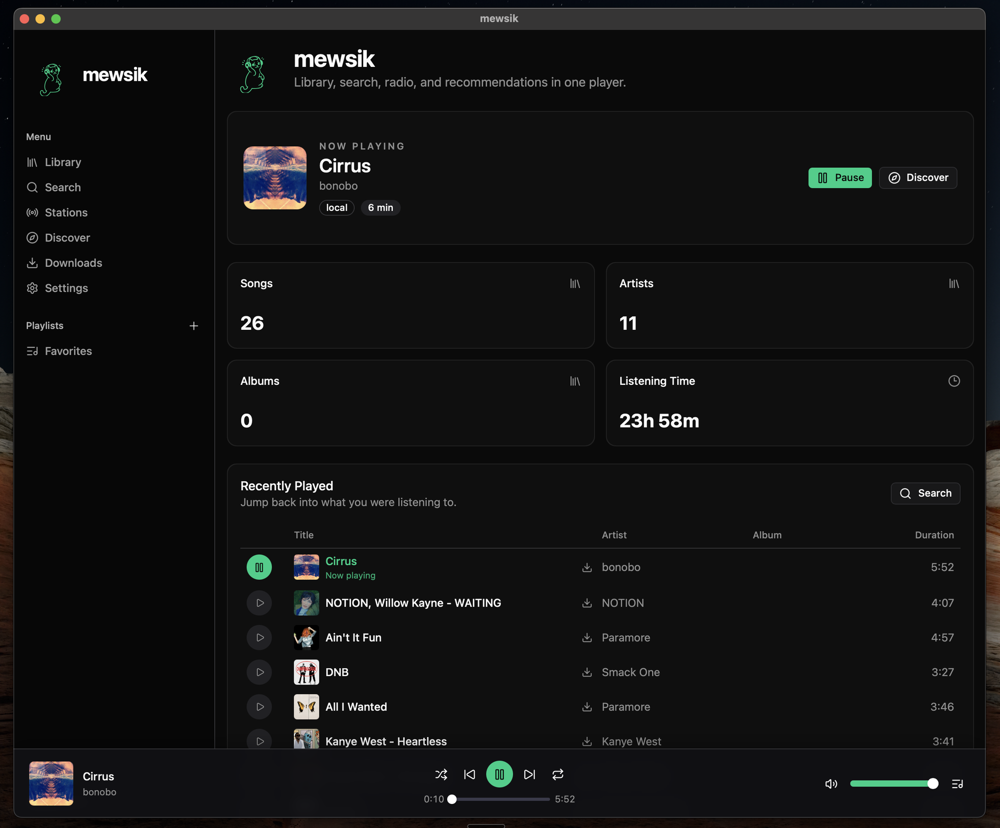

<p align="center">
  
</p>

<h1 align="center">mewsik</h1>

<p align="center">
  An open-source desktop music player and visualizer prototype built with Tauri, Svelte, and Rust.
</p>

<p align="center">
  <a href="https://github.com/RemingtonWilcox/mewsik/releases">Release history and signing status</a>
</p>

---

## Prototype features

- **Experimental provider search** - Local development builds aggregate YouTube, SoundCloud, and Bandcamp, but those unofficial integrations are not approved for distribution and are blocked by the release gate
- **Local music library** - Scan and play user-owned files with playlists and listening history
- **Radio stations** - Browse 30,000+ internet radio stations by genre
- **Discover** - Listening stats, recently played, and personalized recommendations
- **Playlists** - Create and manage playlists from any source
- **Audio-reactive visuals** - Prism, Soma, and Signal engines with shared musical analysis
- **Keyboard shortcuts** - `Cmd+K` for quick search, `Space` for play/pause

## Screenshot



## Install (early beta)

There is not yet a current signed public installer. The existing `v0.1.0` release is a legacy Mac artifact, not the reviewed Windows/macOS bootstrap described below. The release workflow is fail-closed while the prototype's unofficial YouTube, SoundCloud, and Bandcamp search/playback/download paths are replaced, licensed, or disabled for distributed builds. This repository builds native Windows and macOS applications, but the public release process is still being hardened. Check each GitHub release for its exact supported platforms and signing status. Version 0.1 cannot update itself, so moving to the first signed updater-capable release is a one-time manual install. Signed stable Windows releases built by the protected release workflow can then check for newer signed releases and offer an opt-in update in Settings. Local, source-built, unsigned, and current macOS builds keep the updater disabled and are updated manually.

### Windows 10/11 (x64)

Use the `*_x64-setup.exe` NSIS installer when one is attached to a release. It uses a normal setup wizard, installs for the signed-in Windows user under `%LOCALAPPDATA%`, and does not require an administrator account. The app chooses that user's Windows Music folder for downloads by default; no username or machine-specific path is hard-coded.

Current local Windows builds are unsigned. Windows SmartScreen will normally show an unknown-publisher warning until the release is Authenticode-signed and has established reputation. Do not represent an unsigned friend build as a trusted public release.

### macOS 13.5+

Use the signed and notarized `.dmg` for the Mac's processor when one is attached to the [Releases page](https://github.com/RemingtonWilcox/mewsik/releases/latest):

- `aarch64` for Apple Silicon
- `x64` for Intel

1. Download the `.dmg`
2. Open it and drag **mewsik** to your Applications folder
3. Launch **mewsik** from Applications

If macOS says it cannot verify the developer, that artifact did not pass the current release process. Verify the release notes rather than bypassing Gatekeeper for a general public install.

### Build from Source

#### Prerequisites

- [Node.js](https://nodejs.org/) 24.15.0 (also pinned in `.node-version`)
- [pnpm](https://pnpm.io/) 10.11.0
- [Rust](https://rustup.rs/) (`rust-toolchain.toml` installs the pinned toolchain)
- Windows: Microsoft C++ Build Tools and WebView2 development prerequisites
- macOS: Xcode Command Line Tools (`xcode-select --install`)

#### Steps

```bash
# Clone the repo
git clone https://github.com/RemingtonWilcox/mewsik.git
cd mewsik

# Install dependencies
pnpm install --frozen-lockfile

# Run in development mode
pnpm tauri:dev

# Build for production
pnpm tauri:build
```

Windows installers are written to `src-tauri/target/release/bundle/nsis/` and `src-tauri/target/release/bundle/msi/`. Native macOS app bundles and DMGs are written to `src-tauri/target/release/bundle/macos/` and `src-tauri/target/release/bundle/dmg/`. The self-contained runtime packaging step intentionally rejects cross-platform and cross-architecture builds.

For the complete signing, notarization, versioning, upgrade-safety, and release checklist, see [docs/releasing.md](docs/releasing.md).

## User data and downloads

mewsik resolves folders for the currently signed-in operating-system user. On Windows, private library data is under `%APPDATA%\mewsik\mewsik\data`; on macOS it is under `~/Library/Application Support/app.mewsik.mewsik`. New downloads default to the user's `Music/Mewsik` folder (or the operating system's Downloads folder if Music is unavailable), and the location can be changed in Settings.

Installing a newer build does not intentionally remove the SQLite library, settings, or downloaded music. Before a database schema migration, the app now creates a consistent backup next to the database and retains the three newest migration backups.

## Tech Stack

| Layer | Technology |
|-------|-----------|
| **Desktop framework** | [Tauri v2](https://tauri.app/) |
| **Frontend** | [Svelte 5](https://svelte.dev/) + [SvelteKit](https://kit.svelte.dev/) |
| **UI components** | [shadcn-svelte](https://shadcn-svelte.com/) + [Tailwind CSS v4](https://tailwindcss.com/) |
| **Backend** | Rust (Tauri commands) |
| **Audio engine** | [rodio](https://github.com/RustAudio/rodio) + [Symphonia](https://github.com/pdeljanov/Symphonia) |
| **Database** | SQLite via [rusqlite](https://github.com/rusqlite/rusqlite) |
| **External sources** | Node.js sidecar with [youtubei.js](https://github.com/LuanRT/YouTube.js), [soundcloud-fetch](https://github.com/patrickkfkan/soundcloud-fetch), [bandcamp-fetch](https://github.com/patrickkfkan/bandcamp-fetch) |

## Project Structure

```
mewsik/
  src/                    # Svelte frontend
    routes/               # Pages (library, search, stations, etc.)
    lib/
      components/         # UI components
      state/              # Svelte stores (player, library, search)
      api/                # Tauri command bindings
  src-tauri/              # Rust backend
    src/
      audio/              # Audio engine (playback, streaming, buffering)
      commands/           # Tauri commands (search, playback, downloads)
      sources/            # External source providers + sidecar manager
      db/                 # SQLite database (models, queries, migrations)
      download/           # Download manager
  sidecar/                # Node.js sidecar for external sources
    src/
      providers/          # YouTube, SoundCloud, Bandcamp providers
```

## How It Works

mewsik runs a Rust backend with a Svelte frontend inside a Tauri window. For external music sources (YouTube, SoundCloud, Bandcamp), a Node.js sidecar process handles search and stream URL resolution via provider-specific libraries. The Rust audio engine streams audio via HTTP, buffers it to a temp file, and decodes with Symphonia. All metadata and library state is stored in a local SQLite database.

## Contributing

Contributions are welcome. The app is actively in development - check the [issues](https://github.com/RemingtonWilcox/mewsik/issues) for open tasks.

## License

MIT
